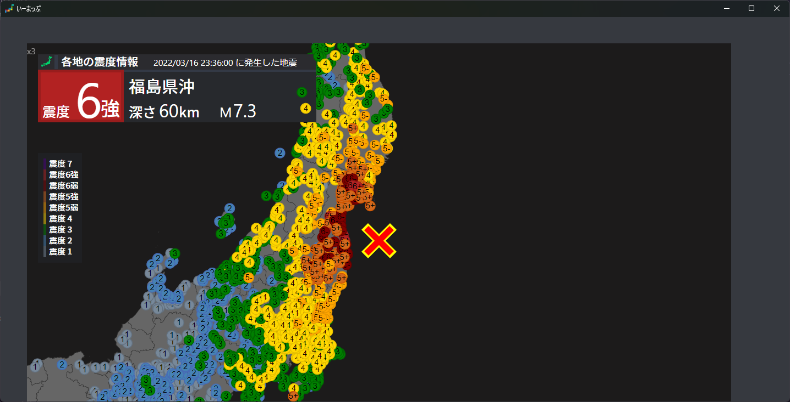

# いーまっぷ 

Earthquake Mapping Soft

## What is this?

This soft is used D3.js, to make a earthquake detail map.

これはD3.jsを使った震度分布図を作成するやつです。

(動作部分はD3.jsで、パッケージ化はElectronです。)



## How to use this soft?

このソフトは

`Noto Sans jp`と`Inter Medium 500`と`Inter Regular 400`が必要です。

`Noto Sans jp`と`Inter Medium 500`と`Inter Regular 400`が必要です。

（重要なことだから2回)


### [1] GithubからBuildして入れる場合 - Advanced Download

At the first :

まずは最初に :

```cmd
git clone https://github.com/akikaki-bot/emap
```

↑ run the `git clone` to clone this repository ↑

を実行し、

```cmd
npm i 
```

↑ run the package install. ↑

を実行してください。

そして、

↓ Then ↓

```cmd
electron-builder
```

Finally, a setup.exe will be generated and the installation can begin.

でsetup.exeファイルが生成されます。

### [2] ふつうにsetupからいれたい - Normal Download

↓ ここからダウンロードしてください ↓

[最新版ダウンロード](https://drive.google.com/file/d/1V9p1NOFja70zgXAkhe0Vp78F7ENlB0nQ/view?usp=share_link)

↑ Please download from here. ↑

## 重要 - Important

DO NOT REDISTRIBUTION THIS SOFT.

二次配布は絶対にやめてください。

I DONT PERMISSION IN ANY CASE IT.

いかなる場合でも許しません。

## License

たぶんだけど

**CC BY-ND 4.0**

の下保護されます
